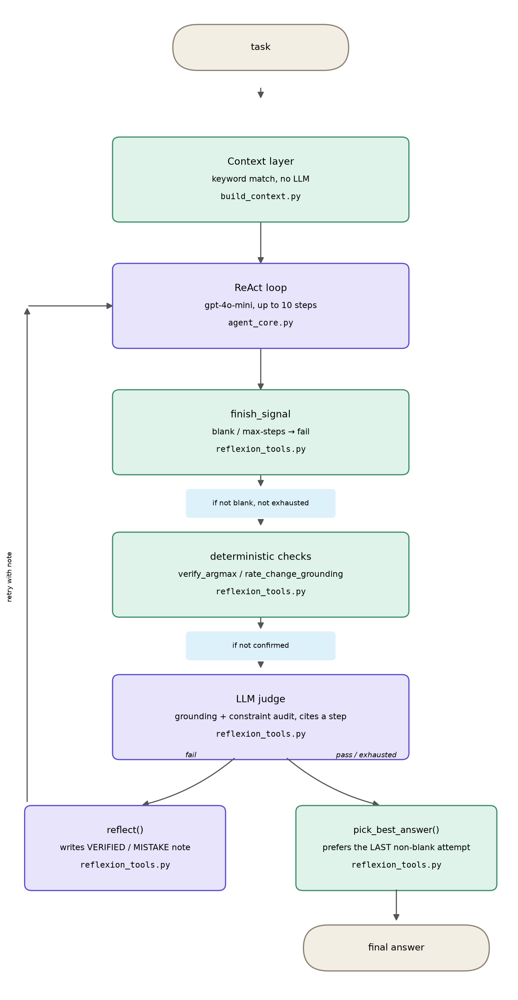

## How context and deterministic tools took GPT-4o-mini from 12.67% to 57.11% on DABstep

A learning project which studies agent evaluation and agent design on [DABstep](https://huggingface.co/spaces/adyen/DABstep) (Data Agent Benchmark for Multi-step Reasoning, Adyen and Hugging Face — [paper](https://arxiv.org/abs/2506.23719), [dataset, CC-BY-4.0](https://huggingface.co/datasets/adyen/data-agents-benchmark), [write-up](https://www.adyen.com/knowledge-hub/data-agent-benchmark-for-multi-step-reasoning-dabstep)). 450 payment-fee-analysis tasks divided in 72 Easy and 378 Hard. Every run below used `gpt-4o-mini`.

## Results

| Run | Easy % | Hard % | Overall % |
| --- | --- | --- | --- |
| base_gpt4o_mini | 61.11 | 3.44 | 12.67 |
| react_tools | 61.11 | 3.70 | 12.89 |
| reflexion | 69.44 | 3.70 | 14.22 |
| react_context | 79.17 | 19.31 | 28.89 |
| react_context_tools | 75.00 | 18.78 | 27.78 |
| react_context_tools_V2 | 75.00 | 19.05 | 28.00 |
| reflexion_v2 | 72.22 | 28.31 | 35.33 |
| **reflexion_V3** | 76.39 | **53.44** | **57.11** |

Full data in `results/ablation.csv`

Charts: `results/figures/ablation_hard.png`, `results/figures/ablation_overall.png`.

## What made the difference

We randomly selected 43 Hard tasks and solved them manually - we call this the **Golden Dataset**. Analyzing `base_gpt4o_mini`'s traces against the Golden Dataset surfaced **four recurring failure classes**.

**Class 1 (Knowledge gap).** `manual.md` (about 5,500 tokens) holds most of the domain rules a Hard task needs - the fee formula, wildcard semantics, month derivation. The agent opened it in 0 of 450 tasks, despite listing the directory almost every time. It guessed instead, and guessed differently on identical question templates.

**Class 2 (False conclusions from silent failures).** The ReAct loop's only tool is Python code execution. When a filter silently returned zero rows — a dtype mismatch, a wrong column, a wildcard read backwards - the agent treated the emptiness as a fact about the data, not a bug in its own code, and answered from it anyway.

**Class 3 (Counterfactual structure).** A "what would change if X" question needs a real before-value, a real after-value, and a subtraction, computed in that order. The agent would compute one side only, get the right numbers with the sign flipped, or skip the comparison and answer from a single value - a different mistake each time, even on identical templates.

**Class 4 (Solved an adjacent problem).** The agent would answer a real, defensible question - just not the one asked: the wrong entity, the wrong time period, a sum where the question needed a mean, a superset where it needed an exact match.

Every change from **react_tools** to **reflexion_V3** was made with these four classes of problems in mind. The design choices fall into two groups: **context management** and the **verification layer**.

**Context management.** Three approaches were tried, in the following order. Each is shown with the run where it was tested and the number that served as proof it worked or didn't.

**1. Give the model explicit tools to read domain context on demand**, from `manual.md`, `payments-readme.md`, and the other reference files.

| Run | `manual.md` opened | Hard % |
| --- | --- | --- |
| base_gpt4o_mini | no read-document tool existed | 3.44 |
| react_tools | 4 / 450 | 3.70 |

Giving the agent a tool to read `manual.md` barely moved Hard accuracy. It opened the file 4 times out of 450, despite listing the working directory in most of them - having the tool available did not mean the agent chose to use it.

**2. Load the relevant context directly into the agent's prompt**, instead of leaving retrieval to the model.

| Run | Context injected? | Hard % |
| --- | --- | --- |
| react_tools | No | 3.70 |
| react_context | Yes | 19.31 |

This is the jump that actually closed most of class 1. But it still asked the model to apply the injected rules correctly, step by step, for every question - which is where class 3 kept failing.

**3. Stop relying on the model's own recall for rules and formulas. Give it deterministic Python functions to call as tools instead.**

This was applied once per archetype(type of task), not once overall. Each row below is a separate function, added and validated separately, on the same golden set:

| Archetype (type of task) | Function | Before | After |
| --- | --- | --- | --- |
| delta-rate | `rate_change_delta()` | 0 / 5 (`golden_full_reflexion`) | 5 / 5 (`golden_delta_fix`) |
| delta-MCC | `mcc_change_delta()` | 0 / 2 (`golden_full_reflexion`) | 2 / 2 (`golden_mcc_fix`) |
| total-fees | `total_fees()` | 3 / 6 (`golden_full_reflexion`) | 6 / 6 (`golden_fee_total_fix`) |
| fee-ID-match | `applicable_fee_ids()` | 2 / 5 (`golden_full_reflexion`) | 4 / 5 (`golden_fee_total_fix`) |
| scheme-choice | `reroute_totals()` | 2 / 5 (`golden_full_reflexion`) | 5 / 5 (`golden_scheme_fix`) |
| **Golden set total (43 tasks)** | — | **21 / 43** | **37 / 43** |

Every archetype that got its own function moved to, or close to, a clean score and stayed there across the runs made after it shipped - this is not one lucky fix, it is the same mechanism repeated five times on five different question shapes. The overall golden-set total moved from **21/43** to **37/43** across the same span, and it is the same class of fix behind the leaderboard jump from `reflexion_v2` (28.31 Hard) to `reflexion_V3` (53.44 Hard).

**Verification layer.** When the ReAct agent finishes a task, there is no ground truth or golden answer to check its output against. The best available verification is to look for provenance in the agent's reasoning and actions, and use a judge that checks that reasoning and those actions against a rubric - a set of instructions - to confirm whether they are actually grounded in it, not just plausible. Two different approaches to designing this judge were tried; in both, the judge gives the ReAct agent a feedback signal it can act on:

1. **reflexion**: Checked against a fixed list of failure modes (`blank_answer`, `format_violation`, `unsupported_by_evidence`, `unverified_assumption`, `silent_empty_result`, `incomplete_analysis`). The judge's role was to evaluate the agent's trace, and if it found a discrepancy, label it with the matching failure mode. Adding a judge to flag failure modes did not fix the score - Hard task accuracy barely moved (3.44% → 3.70%).

   The main reason for this failure was similar to the ReAct agent's: the judge did not have the grounding rules for a task either. At this stage the judge worked from a rubric that asked whether the agent's response had supporting evidence, whether a format violation occurred, and so on. The judge could make a verdict on these checks, but what we actually wanted was for it to pinpoint the exact place in the trace where something went wrong, so the ReAct agent would know precisely when and how it failed, with feedback grounded in that specific context. This is the same problem as Class 1 (Knowledge Gap), just showing up in the judge instead of the agent.

2. **reflexion_V2:** One of the main changes from `reflexion` was that the judge now checks whether the assumptions, rules, formulas, and findings the agent uses actually map back to real context or the original source rules - rather than just checking the response against a rubric of named failure modes. The main findings at this stage were:

   **a. What works: judging provenance instead of a rubric.** Across the archetypes examined during this ablation, a judge that only checked the agent's answer against a fixed list of failure modes often failed to send a useful signal back - its feedback didn't say what, specifically, had gone wrong in the agent's own trace. Once the judge was changed to look for provenance instead - checking whether the rules, formulas, definitions, and context the agent actually used could be traced back to something real, rather than just scoring the response against a checklist - its feedback got noticeably better, and this became the direction that held up.

   **b. What is still broken: the judge itself hallucinates.** The counterpart to (a) is that the judge can still hallucinate: it rejects correct answers with reasons the trace disproves, and passes wrong answers just because they look grounded, not because they are right. Looking for provenance also only half-solved this — it catches a fabricated claim, but a real omission has nothing to cite, so the judge waves it through instead. Neither failure mode is fully solved; it is why the judge is still marked as open work in Limitations.

## Architecture

\## Limitations

- **Unvalidated.** All scores are my own submissions on DABstep's Unvalidated tab. Since the submission window was closed.
- **One benchmark, one small model, mostly single-run scores.** Repeated-run variance was not measured for the final agent this pass; this was a deliberate scope decision, not an oversight.
- **Tools were built per archetype from the public tasks.** The score partly measures coverage of the test distribution, not general capability. Transfer to unseen question shapes is untested. Two archetypes have no dedicated tool (aggregation, ACI-steering) — those still fail the way the original agent did.
- **Eight submissions with score feedback is mild adaptive tuning**, even though the golden set used for diagnosis was solved independently of the benchmark's hidden answers.
- **Tools make the interpretation of the rules deterministic, including any misreading.** A wrong tool fails identically on every matching question, not randomly — that is a different failure shape than an unreliable model, not a safer one by default.
- **No comparison against a stronger model using the same tools.** Nothing here says `gpt-4o-mini` beats other models in general; it says this specific model, with these specific tools, scores this way on this specific benchmark.
- **The judge can still be improved.** Reducing hallucination and false rejections of correct answers is open work, not a solved problem — see the "Verification layer" findings above for the specific cases found so far.

## How to reproduce

```bash
python3 -m venv .venv
source .venv/bin/activate
pip install -r requirements.txt
```

Download the DABstep dataset from [its Hugging Face source](https://huggingface.co/datasets/adyen/data-agents-benchmark) and place it at `DS-Agent/DataSet/` (with `context/` and `tasks/` subfolders) — that is where `code/agent_core.py` looks for it.

Set the model endpoint in a `.env` file (`ENDPOINT`, `SUBSCRIPTION_KEY` for an Azure OpenAI-compatible endpoint — see `code/README.md`). Never commit `.env`; it is gitignored here.

Run a single task, or the full split:

```bash
python3 code/reflexion_tools.py --split dev
python3 code/reflexion_tools.py --split all --concurrency 2
```

Traces, per-attempt diagnostics, and answers are written under `runs/<agent>_<deployment>/<split>/<timestamp>/` at the repo root (`answers.jsonl`, `attempts.jsonl`, `trace.jsonl`) — every run lands in that same tree, by design, so runs stay comparable across timestamps. `code/README.md` has more detail; `code/` is a frozen snapshot of the implementation as of the `reflexion_V3` result, not the live development tree.

### Reproducibility check

The full 450-task `reflexion_V3` run costs real API time and money to redo end to end, so instead this was checked directly against the golden set (`code/golden/golden_set.json`, 43 scored tasks) using the frozen code exactly as documented above, at the same defaults (`--split all`, `temperature 0.2`, `--max-attempts 3`, context injection on):

```bash
python3 code/reflexion_tools.py --split all --concurrency 2 --tasks-ids <the 47 golden task ids>
python3 code/score_golden.py runs/reflexion_tools_gpt-4o-mini/all/<timestamp>
```

That run scored **39/43 (90.7%)**, against the **37/43 (86.05%)** reported in "What made the difference" above. Not identical — this calls a live model at `temperature 0.2`, not a deterministic replay, so exact counts move run to run — but the same shape: every archetype with a dedicated function scored at or near 100% (total-fees 6/6, scheme-choice 5/5, delta-rate 5/5, most-expensive-category 5/5, aggregation 2/2, delta-MCC 2/2, fee-ID-match 4/5), and avg-fee stayed the softest archetype in both runs. The 37/43 figure in the Results and "What made the difference" sections above is the one actually submitted to the leaderboard and is left as recorded; this check confirms the mechanism reproduces, not that the count is exact.

Recompute the ablation arithmetic and regenerate the figures:

```bash
python3 scripts/derive_overall.py
python3 scripts/make_figures.py
```

## AI-assistance disclosure

Some of the code was written with Claude Code.

## Credits

- DABstep paper: <https://arxiv.org/pdf/2506.23719>
- Dataset (CC-BY-4.0), Adyen and Hugging Face: <https://huggingface.co/datasets/adyen/DABstep>
- Leaderboard: <https://huggingface.co/spaces/adyen/DABstep>
- Adyen write-up: <https://huggingface.co/blog/dabstep>
- The Learning Process method: <https://huggingface.co/blog/nvidia/nemo-agent-toolkit-data-explorer-dabstep-1st-place>